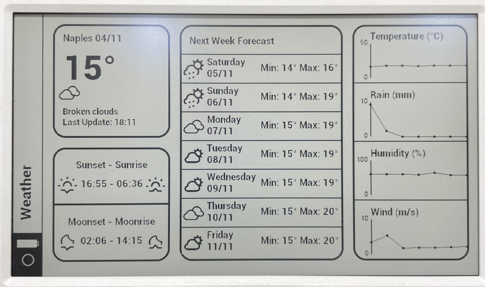

# M5Paper - Modern Weather Dashboard

## Description
This project was born from the desire to approach for the first time the development on an ESP32; the aim of the project is to create a modern weather dashboard that looks great.

The project was and is carried out mainly in my free time; still today it is under development and improvements; as soon as I notice something wrong I will try to fix it. Feel free to report any kind of problems you will find.

Enojy the project and feel free to apply any changes to improve it! 😁

Here is an image of the dashboard look:

---

## Requirements

In order to run the project you will need to:
- Copy the content of [SD-CARD](https://github.com/marcotammaro/M5Paper---Modern-Weather-Dashboard/tree/main/SD-CARD) folder into a micro sd card that should be inserted into the M5Paper before the boot.
- Rename [Config-sample.h](https://github.com/marcotammaro/M5Paper---Modern-Weather-Dashboard/blob/main/src/Config-sample.h) in `Config.h` and edit it with you own informations:
    - `REFRESH_INTERVAL` is the time (in seconds) after while the M5Paper start up and update the weather info
    - `WIFI_SSID` and `WIFI_PW` are the ssid name and the password of you own home network
    - `LATITUDE` and `LONGITUDE` are the coordinates to the city where you want to have weather informations, you can easily get them from [Google Maps](https://www.google.it/maps/preview)
    - `LOCALIZATION` is a parameter sent to OpenWeatherMap API to have some information localized. In order to localize the entire dashboard you can edit the [Strings.h](https://github.com/marcotammaro/M5Paper---Modern-Weather-Dashboard/blob/main/src/Strings.h) file with your own language
    - `UNITS` the unit used to retrive the data and used to specify the unit measure of temperature, it could be "metric" (Celsius), "imperial" (Fahrenheit) or "standard" (Kelvin)
    - `OPENWEATHER_API` is the API Key that you should create on [OpenWeatherMap website](https://openweathermap.org/api)

---

## One More Thing

If you are interested in support brackets for the M5Paper, i designed two of them:
- [M5Paper Skadis Support](https://www.thingiverse.com/thing:4967473)
- [M5Paper Invisible Magnetic Support](https://www.thingiverse.com/thing:5606942)

---

## Credits
I want to thank [Bastelschlumpf](https://github.com/Bastelschlumpf/M5PaperWeather) for providing the functions to get the data from OpenWeatherMap.